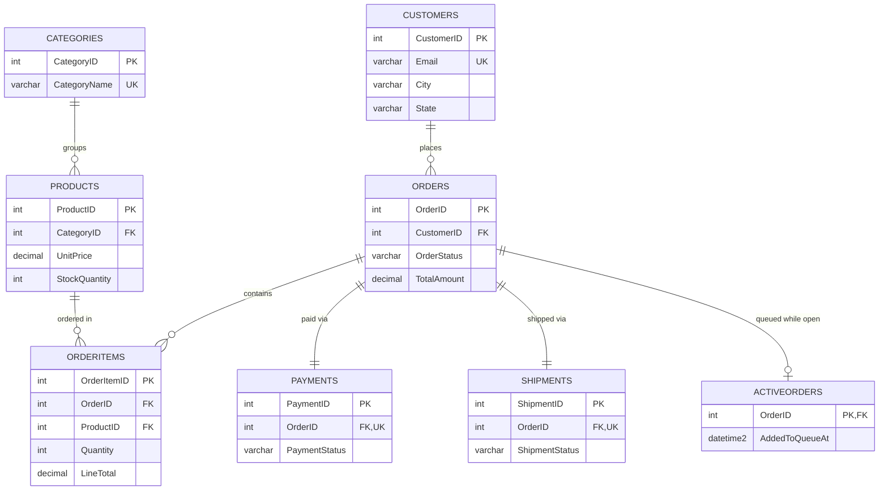

# 🛒 E-Commerce Order Management System — SQL Server DBMS Mini-Project


A complete, academically-scoped order-management database — **pure Microsoft SQL Server / T-SQL, executable start to finish in SSMS.** No application layer: every requirement (schema, normalization, queries, views, procedures, functions, triggers, transactions, indexing, bulk data, a live order queue) is demonstrated entirely inside the database.

## Features

- 8 normalized tables (1NF → 2NF → 3NF, explained against real entities) with full PK/FK/CHECK/UNIQUE/DEFAULT constraints
- 20 business queries — joins, subqueries (incl. correlated), `EXISTS`/`IN`, `CASE`, aggregates, date filtering
- 2 views, 2 stored procedures (`TRY...CATCH` + transactions), 2 scalar/table-valued functions, 2 triggers
- `BEGIN TRANSACTION` / `SAVE TRANSACTION` partial rollback / full `ROLLBACK` / `COMMIT` demos
- 4 indexes + `STATISTICS IO` demo, 8 reporting queries
- Optional bulk-data generator — scales the same schema to **~100,000 orders / ~250,000 order items**, fully set-based, idempotent
- A "real-time" active-order queue: a row appears the instant an order's placed and disappears the instant it's delivered — while `Orders` keeps full history forever
- `scripts/rayso_link.py` — turn any query/proc/trigger into a shareable [ray.so](https://ray.so) code image

## Tech stack

Microsoft SQL Server · T-SQL · SQL Server Management Studio (SSMS) · Git

## ER Diagram



`AuditLog` isn't in the diagram — it's a free-standing log table populated by triggers, logging against multiple source tables rather than one FK.

## Repo structure

```
ecommerce-dbms-project/
├── docs/
│   ├── 01_design_and_normalization.md   Problem statement, ER description, 1NF/2NF/3NF
│   └── 02_test_cases_and_checklist.md   Test cases, screenshot plan, requirement checklist
├── sql/
│   ├── 01_create_database.sql           CREATE DATABASE / USE / safe re-run
│   ├── 02_create_tables.sql             8 tables, PK/FK/constraints, dependency-safe order
│   ├── 03_indexes.sql                   4 non-clustered indexes + STATISTICS demo
│   ├── 04_sample_data.sql               Curated sample rows (10 cust/18 prod/18 orders)
│   ├── 04b_bulk_data.sql                Optional: scales to ~5k cust / ~500 prod / ~100k orders
│   ├── 05_queries.sql                   20 business queries
│   ├── 06_views.sql                     2 views
│   ├── 07_procedures.sql                2 stored procedures
│   ├── 08_functions.sql                 1 scalar + 1 table-valued function
│   ├── 09_triggers.sql                  2 AFTER triggers (set-based, multi-row safe)
│   ├── 10_transactions.sql              SAVE TRANSACTION + full ROLLBACK demos
│   ├── 11_reports.sql                   8 reporting queries
│   └── 12_active_orders_queue.sql       Live "placed → delivered" order queue
├── scripts/
│   └── rayso_link.py                    File/snippet → ray.so share URL
└── .gitignore
```

## Getting started

1. Clone or unzip this repo, open SSMS, connect to your instance.
2. Open each file under `sql/` and run in numeric order (`GO` batches respected — just hit Execute per file):
   ```
   01 → 02 → 03 → 04 → [04b optional] → 05 → 06 → 07 → 08 → 09 → 10 → 11 → 12
   ```
3. `04b_bulk_data.sql` is additive and idempotent — skip it for a small/quick demo, run it for the ~100k-order version. Either way, curated IDs (customers 1-10, products 1-18, orders 1-18) stay fixed, so every worked example below always resolves.

## Code snippets

**Constrained table** (`02_create_tables.sql`)
🔗 [View on ray.so](https://ray.so/#background=true&darkMode=true&padding=16&theme=vercel&language=sql&title=02_create_tables.sql%20%28L85-102%29&code=Q1JFQVRFIFRBQkxFIGRiby5PcmRlckl0ZW1zCigKICAgIE9yZGVySXRlbUlEICBJTlQgSURFTlRJVFkoMSwxKSBOT1QgTlVMTCwKICAgIE9yZGVySUQgICAgICBJTlQgICAgICAgICAgICAgICAgTk9UIE5VTEwsCiAgICBQcm9kdWN0SUQgICAgSU5UICAgICAgICAgICAgICAgIE5PVCBOVUxMLAogICAgUXVhbnRpdHkgICAgIElOVCAgICAgICAgICAgICAgICBOT1QgTlVMTCwKICAgIFVuaXRQcmljZSAgICBERUNJTUFMKDEwLDIpICAgICAgTk9UIE5VTEwsICAgLS0gcHJpY2UgYXQgdGltZSBvZiBzYWxlIChoaXN0b3J5LXNhZmUpCiAgICBMaW5lVG90YWwgICAgQVMgKENBU1QoUXVhbnRpdHkgQVMgREVDSU1BTCgxMiwyKSkgKiBVbml0UHJpY2UpIFBFUlNJU1RFRCwKICAgIENPTlNUUkFJTlQgUEtfT3JkZXJJdGVtcyBQUklNQVJZIEtFWSBDTFVTVEVSRUQgKE9yZGVySXRlbUlEKSwKICAgIENPTlNUUkFJTlQgRktfT3JkZXJJdGVtc19PcmRlcnMgRk9SRUlHTiBLRVkgKE9yZGVySUQpCiAgICAgICAgUkVGRVJFTkNFUyBkYm8uT3JkZXJzIChPcmRlcklEKSBPTiBERUxFVEUgQ0FTQ0FERSwKICAgIENPTlNUUkFJTlQgRktfT3JkZXJJdGVtc19Qcm9kdWN0cyBGT1JFSUdOIEtFWSAoUHJvZHVjdElEKQogICAgICAgIFJFRkVSRU5DRVMgZGJvLlByb2R1Y3RzIChQcm9kdWN0SUQpLAogICAgQ09OU1RSQUlOVCBDS19PcmRlckl0ZW1zX1F1YW50aXR5IENIRUNLIChRdWFudGl0eSA%2BIDApLAogICAgQ09OU1RSQUlOVCBDS19PcmRlckl0ZW1zX1VuaXRQcmljZSBDSEVDSyAoVW5pdFByaWNlID4gMCksCiAgICBDT05TVFJBSU5UIFVRX09yZGVySXRlbXNfT3JkZXJfUHJvZHVjdCBVTklRVUUgKE9yZGVySUQsIFByb2R1Y3RJRCkKKTsKR08K) — OrderItems — 8 tables total, each with PK/FK/CHECK/UNIQUE/DEFAULT.


**Correlated subquery** (`05_queries.sql`, Q13)
🔗 [View on ray.so](https://ray.so/#background=true&darkMode=true&padding=16&theme=vercel&language=sql&title=05_queries.sql%20%28L112-121%29&code=LS0gUTEzIFtDb3JyZWxhdGVkIHN1YnF1ZXJ5XSBQcm9kdWN0cyBwcmljZWQgYWJvdmUgdGhlIGF2ZXJhZ2UgcHJpY2Ugb2YgdGhlaXIgb3duIGNhdGVnb3J5LgpTRUxFQ1QgcC5Qcm9kdWN0TmFtZSwgY2F0LkNhdGVnb3J5TmFtZSwgcC5Vbml0UHJpY2UKRlJPTSBkYm8uUHJvZHVjdHMgcApKT0lOIGRiby5DYXRlZ29yaWVzIGNhdCBPTiBjYXQuQ2F0ZWdvcnlJRCA9IHAuQ2F0ZWdvcnlJRApXSEVSRSBwLlVuaXRQcmljZSA%2BICgKICAgIFNFTEVDVCBBVkcocDIuVW5pdFByaWNlKQogICAgRlJPTSBkYm8uUHJvZHVjdHMgcDIKICAgIFdIRVJFIHAyLkNhdGVnb3J5SUQgPSBwLkNhdGVnb3J5SUQKKTsKR08K) — Q13 of 20 — products priced above their own category's average.


**View** (`06_views.sql`)
🔗 [View on ray.so](https://ray.so/#background=true&darkMode=true&padding=16&theme=vercel&language=sql&title=06_views.sql%20%28L55-70%29&code=Q1JFQVRFIFZJRVcgZGJvLnZ3X1Byb2R1Y3RTYWxlc1N1bW1hcnkgQVMKU0VMRUNUCiAgICBwLlByb2R1Y3RJRCwKICAgIHAuUHJvZHVjdE5hbWUsCiAgICBjYXQuQ2F0ZWdvcnlOYW1lLAogICAgcC5Vbml0UHJpY2UsCiAgICBwLlN0b2NrUXVhbnRpdHksCiAgICBwLlJlb3JkZXJMZXZlbCwKICAgIElTTlVMTChTVU0ob2kuUXVhbnRpdHkpLCAwKSAgIEFTIFVuaXRzU29sZCwKICAgIElTTlVMTChTVU0ob2kuTGluZVRvdGFsKSwgMCkgIEFTIFJldmVudWUKRlJPTSBkYm8uUHJvZHVjdHMgcApKT0lOIGRiby5DYXRlZ29yaWVzIGNhdCAgICBPTiBjYXQuQ2F0ZWdvcnlJRCA9IHAuQ2F0ZWdvcnlJRApMRUZUIEpPSU4gZGJvLk9yZGVySXRlbXMgb2kgT04gb2kuUHJvZHVjdElEID0gcC5Qcm9kdWN0SUQKR1JPVVAgQlkgcC5Qcm9kdWN0SUQsIHAuUHJvZHVjdE5hbWUsIGNhdC5DYXRlZ29yeU5hbWUsCiAgICAgICAgIHAuVW5pdFByaWNlLCBwLlN0b2NrUXVhbnRpdHksIHAuUmVvcmRlckxldmVsOwpHTwo%3D) — vw_ProductSalesSummary — 1 of 2 views.


**Procedure with validation + transaction** (`07_procedures.sql`)
🔗 [View on ray.so](https://ray.so/#background=true&darkMode=true&padding=16&theme=vercel&language=sql&title=07_procedures.sql%20%28L24-82%29&code=Q1JFQVRFIFBST0NFRFVSRSBkYm8udXNwX0NyZWF0ZU9yZGVyCiAgICBAQ3VzdG9tZXJJRCAgSU5ULAogICAgQFByb2R1Y3RJRCAgIElOVCwKICAgIEBRdWFudGl0eSAgICBJTlQsCiAgICBATmV3T3JkZXJJRCAgSU5UIE9VVFBVVApBUwpCRUdJTgogICAgU0VUIE5PQ09VTlQgT047CiAgICBTRVQgWEFDVF9BQk9SVCBPTjsKCiAgICBCRUdJTiBUUlkKICAgICAgICBJRiBOT1QgRVhJU1RTIChTRUxFQ1QgMSBGUk9NIGRiby5DdXN0b21lcnMgV0hFUkUgQ3VzdG9tZXJJRCA9IEBDdXN0b21lcklEKQogICAgICAgICAgICBUSFJPVyA1MDAwMSwgJ0ludmFsaWQgQ3VzdG9tZXJJRC4nLCAxOwoKICAgICAgICBJRiBAUXVhbnRpdHkgSVMgTlVMTCBPUiBAUXVhbnRpdHkgPD0gMAogICAgICAgICAgICBUSFJPVyA1MDAwMiwgJ1F1YW50aXR5IG11c3QgYmUgZ3JlYXRlciB0aGFuIHplcm8uJywgMTsKCiAgICAgICAgQkVHSU4gVFJBTlNBQ1RJT047CgogICAgICAgICAgICBERUNMQVJFIEBQcmljZSBERUNJTUFMKDEwLDIpLCBAU3RvY2sgSU5UOwoKICAgICAgICAgICAgU0VMRUNUIEBQcmljZSA9IFVuaXRQcmljZSwgQFN0b2NrID0gU3RvY2tRdWFudGl0eQogICAgICAgICAgICBGUk9NIGRiby5Qcm9kdWN0cyBXSVRIIChVUERMT0NLLCBST1dMT0NLKQogICAgICAgICAgICBXSEVSRSBQcm9kdWN0SUQgPSBAUHJvZHVjdElEIEFORCBJc0FjdGl2ZSA9IDE7CgogICAgICAgICAgICBJRiBAUHJpY2UgSVMgTlVMTAogICAgICAgICAgICAgICAgVEhST1cgNTAwMDMsICdQcm9kdWN0IG5vdCBmb3VuZCBvciBpbmFjdGl2ZS4nLCAxOwoKICAgICAgICAgICAgSUYgQFN0b2NrIDwgQFF1YW50aXR5CiAgICAgICAgICAgICAgICBUSFJPVyA1MDAwNCwgJ0luc3VmZmljaWVudCBzdG9jayBmb3IgcmVxdWVzdGVkIHF1YW50aXR5LicsIDE7CgogICAgICAgICAgICBJTlNFUlQgSU5UTyBkYm8uT3JkZXJzIChDdXN0b21lcklELCBPcmRlclN0YXR1cywgVG90YWxBbW91bnQpCiAgICAgICAgICAgIFZBTFVFUyAoQEN1c3RvbWVySUQsICdQZW5kaW5nJywgMCk7CgogICAgICAgICAgICBTRVQgQE5ld09yZGVySUQgPSBTQ09QRV9JREVOVElUWSgpOwoKICAgICAgICAgICAgSU5TRVJUIElOVE8gZGJvLk9yZGVySXRlbXMgKE9yZGVySUQsIFByb2R1Y3RJRCwgUXVhbnRpdHksIFVuaXRQcmljZSkKICAgICAgICAgICAgVkFMVUVTIChATmV3T3JkZXJJRCwgQFByb2R1Y3RJRCwgQFF1YW50aXR5LCBAUHJpY2UpOwoKICAgICAgICAgICAgVVBEQVRFIGRiby5Qcm9kdWN0cwogICAgICAgICAgICBTRVQgU3RvY2tRdWFudGl0eSA9IFN0b2NrUXVhbnRpdHkgLSBAUXVhbnRpdHkKICAgICAgICAgICAgV0hFUkUgUHJvZHVjdElEID0gQFByb2R1Y3RJRDsKCiAgICAgICAgICAgIFVQREFURSBkYm8uT3JkZXJzCiAgICAgICAgICAgIFNFVCBUb3RhbEFtb3VudCA9IEBRdWFudGl0eSAqIEBQcmljZQogICAgICAgICAgICBXSEVSRSBPcmRlcklEID0gQE5ld09yZGVySUQ7CgogICAgICAgIENPTU1JVCBUUkFOU0FDVElPTjsKCiAgICAgICAgUFJJTlQgQ09OQ0FUKCdPcmRlciAnLCBATmV3T3JkZXJJRCwgJyBjcmVhdGVkIHN1Y2Nlc3NmdWxseS4nKTsKICAgIEVORCBUUlkKICAgIEJFR0lOIENBVENICiAgICAgICAgSUYgWEFDVF9TVEFURSgpIDw%2BIDAKICAgICAgICAgICAgUk9MTEJBQ0sgVFJBTlNBQ1RJT047CgogICAgICAgIERFQ0xBUkUgQEVyck1zZyBOVkFSQ0hBUig0MDAwKSA9IEVSUk9SX01FU1NBR0UoKTsKICAgICAgICBUSFJPVyA1MDAwMCwgQEVyck1zZywgMTsKICAgIEVORCBDQVRDSApFTkQ7Cg%3D%3D) — usp_CreateOrder — 1 of 2 procedures, full TRY/CATCH + transaction.


**Function** (`08_functions.sql`)
🔗 [View on ray.so](https://ray.so/#background=true&darkMode=true&padding=16&theme=vercel&language=sql&title=08_functions.sql%20%28L20-31%29&code=Q1JFQVRFIEZVTkNUSU9OIGRiby51Zm5fR2V0T3JkZXJUb3RhbCAoQE9yZGVySUQgSU5UKQpSRVRVUk5TIERFQ0lNQUwoMTIsMikKQVMKQkVHSU4KICAgIERFQ0xBUkUgQFRvdGFsIERFQ0lNQUwoMTIsMik7CgogICAgU0VMRUNUIEBUb3RhbCA9IElTTlVMTChTVU0oTGluZVRvdGFsKSwgMCkKICAgIEZST00gZGJvLk9yZGVySXRlbXMKICAgIFdIRVJFIE9yZGVySUQgPSBAT3JkZXJJRDsKCiAgICBSRVRVUk4gQFRvdGFsOwpFTkQ7Cg%3D%3D) — ufn_GetOrderTotal — scalar function, 1 of 2.


**Trigger — multi-row safe** (`09_triggers.sql`)
🔗 [View on ray.so](https://ray.so/#background=true&darkMode=true&padding=16&theme=vercel&language=sql&title=09_triggers.sql%20%28L22-43%29&code=Q1JFQVRFIFRSSUdHRVIgZGJvLnRyZ19Qcm9kdWN0c19TdG9ja0F1ZGl0Ck9OIGRiby5Qcm9kdWN0cwpBRlRFUiBVUERBVEUKQVMKQkVHSU4KICAgIFNFVCBOT0NPVU5UIE9OOwoKICAgIElGIE5PVCBVUERBVEUoU3RvY2tRdWFudGl0eSkKICAgICAgICBSRVRVUk47CgogICAgSU5TRVJUIElOVE8gZGJvLkF1ZGl0TG9nIChUYWJsZU5hbWUsIE9wZXJhdGlvblR5cGUsIFJlY29yZElELCBDaGFuZ2VkQ29sdW1uLCBPbGRWYWx1ZSwgTmV3VmFsdWUpCiAgICBTRUxFQ1QKICAgICAgICAnUHJvZHVjdHMnLAogICAgICAgICdVUERBVEUnLAogICAgICAgIGQuUHJvZHVjdElELAogICAgICAgICdTdG9ja1F1YW50aXR5JywKICAgICAgICBDQVNUKGQuU3RvY2tRdWFudGl0eSBBUyBWQVJDSEFSKDIwMCkpLAogICAgICAgIENBU1QoaS5TdG9ja1F1YW50aXR5IEFTIFZBUkNIQVIoMjAwKSkKICAgIEZST00gZGVsZXRlZCBkCiAgICBKT0lOIGluc2VydGVkIGkgT04gaS5Qcm9kdWN0SUQgPSBkLlByb2R1Y3RJRAogICAgV0hFUkUgZC5TdG9ja1F1YW50aXR5IDw%2BIGkuU3RvY2tRdWFudGl0eTsKRU5EOwo%3D) — trg_Products_StockAudit — 1 of 2 triggers.


**Transaction — partial rollback via SAVE TRANSACTION** (`10_transactions.sql`)
🔗 [View on ray.so](https://ray.so/#background=true&darkMode=true&padding=16&theme=vercel&language=sql&title=10_transactions.sql%20%28L6-50%29&code=R08KCi8qIC0tLS0tLS0tLS0tLS0tLS0tLS0tLS0tLS0tLS0tLS0tLS0tLS0tLS0tLS0tLS0tLS0tLS0tLS0tLS0tLQogICBERU1PIDE6IFBhcnRpYWwgcm9sbGJhY2sgd2l0aCBTQVZFIFRSQU5TQUNUSU9OCiAgIFNjZW5hcmlvOiBDdXN0b21lciA4IHRyaWVzIHRvIG9yZGVyIHR3byBpdGVtcyBpbiBvbmUgb3JkZXIuCiAgICAgICAgICAgICBUaGUgZmlyc3QgaXRlbSBpcyBmaW5lIGFuZCBnZXRzIGtlcHQuIFRoZSBzZWNvbmQKICAgICAgICAgICAgIGl0ZW0gcmVxdWVzdHMgZmFyIG1vcmUgdGhhbiBpcyBpbiBzdG9jaywgc28gb25seQogICAgICAgICAgICAgdGhlIHdvcmsgZG9uZSBzaW5jZSB0aGUgc2F2ZXBvaW50IGlzIHVuZG9uZSDigJQKICAgICAgICAgICAgIHRoZSBvcmRlciBzdGlsbCBjb21taXRzIHdpdGggdGhlIHZhbGlkIGZpcnN0IGl0ZW0uCiAgIC0tLS0tLS0tLS0tLS0tLS0tLS0tLS0tLS0tLS0tLS0tLS0tLS0tLS0tLS0tLS0tLS0tLS0tLS0tLS0tLSAqLwpERUNMQVJFIEBPcmRlcklEIElOVDsKCkJFR0lOIFRSQU5TQUNUSU9OOwoKICAgIElOU0VSVCBJTlRPIGRiby5PcmRlcnMgKEN1c3RvbWVySUQsIE9yZGVyU3RhdHVzLCBUb3RhbEFtb3VudCkKICAgIFZBTFVFUyAoOCwgJ1BlbmRpbmcnLCAwKTsKCiAgICBTRVQgQE9yZGVySUQgPSBTQ09QRV9JREVOVElUWSgpOwoKICAgIC0tIEl0ZW0gMTogdmFsaWQgKDIgdW5pdHMgb2YgYSAyMDAtdW5pdC1zdG9jayBwcm9kdWN0KS4KICAgIElOU0VSVCBJTlRPIGRiby5PcmRlckl0ZW1zIChPcmRlcklELCBQcm9kdWN0SUQsIFF1YW50aXR5LCBVbml0UHJpY2UpCiAgICBWQUxVRVMgKEBPcmRlcklELCA1LCAyLCAxMjk5LjAwKTsKCiAgICBTQVZFIFRSQU5TQUNUSU9OIEJlZm9yZVNlY29uZEl0ZW07CgogICAgLS0gSXRlbSAyOiA1MCB1bml0cyBvZiBhIHByb2R1Y3QgdGhhdCBvbmx5IGhhcyA4IGluIHN0b2NrIChQcm9kdWN0SUQgMikuCiAgICBJTlNFUlQgSU5UTyBkYm8uT3JkZXJJdGVtcyAoT3JkZXJJRCwgUHJvZHVjdElELCBRdWFudGl0eSwgVW5pdFByaWNlKQogICAgVkFMVUVTIChAT3JkZXJJRCwgMiwgNTAsIDI0OTk5LjAwKTsKCiAgICBJRiAoU0VMRUNUIFN0b2NrUXVhbnRpdHkgRlJPTSBkYm8uUHJvZHVjdHMgV0hFUkUgUHJvZHVjdElEID0gMikgPCA1MAogICAgQkVHSU4KICAgICAgICBST0xMQkFDSyBUUkFOU0FDVElPTiBCZWZvcmVTZWNvbmRJdGVtOwogICAgICAgIFBSSU5UICdJdGVtIDIgcm9sbGVkIGJhY2sgdG8gc2F2ZXBvaW50IChpbnN1ZmZpY2llbnQgc3RvY2spIOKAlCBpdGVtIDEga2VwdC4nOwogICAgRU5ECgogICAgLS0gRGVkdWN0IHN0b2NrIG9ubHkgZm9yIHdoYXQgYWN0dWFsbHkgc3RheWVkIGNvbW1pdHRlZC4KICAgIFVQREFURSBkYm8uUHJvZHVjdHMgU0VUIFN0b2NrUXVhbnRpdHkgPSBTdG9ja1F1YW50aXR5IC0gMiBXSEVSRSBQcm9kdWN0SUQgPSA1OwoKQ09NTUlUIFRSQU5TQUNUSU9OOwpQUklOVCAnVHJhbnNhY3Rpb24gY29tbWl0dGVkIHdpdGggMSBsaW5lIGl0ZW0uJzsKCi0tIFZlcmlmeTogb25seSB0aGUgZmlyc3QgaXRlbSBzdXJ2aXZlcywgdHJpZ2dlciBhbHJlYWR5IHJlY2FsY3VsYXRlZCB0aGUgdG90YWwuClNFTEVDVCAqIEZST00gZGJvLk9yZGVySXRlbXMgV0hFUkUgT3JkZXJJRCA9IEBPcmRlcklEOwpTRUxFQ1QgT3JkZXJJRCwgVG90YWxBbW91bnQgRlJPTSBkYm8uT3JkZXJzIFdIRVJFIE9yZGVySUQgPSBAT3JkZXJJRDsKR08K) — Demo 1 — SAVE TRANSACTION partial rollback, full code + test.


**Live active-order queue** (`12_active_orders_queue.sql`)
🔗 [View on ray.so](https://ray.so/#background=true&darkMode=true&padding=16&theme=vercel&language=sql&title=12_active_orders_queue.sql%20%28L77-91%29&code=Q1JFQVRFIFRSSUdHRVIgZGJvLnRyZ19PcmRlcnNfUmVtb3ZlRnJvbUFjdGl2ZVF1ZXVlCk9OIGRiby5PcmRlcnMKQUZURVIgVVBEQVRFCkFTCkJFR0lOCiAgICBTRVQgTk9DT1VOVCBPTjsKCiAgICBJRiBOT1QgVVBEQVRFKE9yZGVyU3RhdHVzKQogICAgICAgIFJFVFVSTjsKCiAgICBERUxFVEUgYW8KICAgIEZST00gZGJvLkFjdGl2ZU9yZGVycyBhbwogICAgSk9JTiBpbnNlcnRlZCBpIE9OIGkuT3JkZXJJRCA9IGFvLk9yZGVySUQKICAgIFdIRVJFIGkuT3JkZXJTdGF0dXMgSU4gKCdEZWxpdmVyZWQnLCAnQ2FuY2VsbGVkJyk7CkVORDsK) — trg_Orders_RemoveFromActiveQueue — "handed to the person" = row leaves the queue.


## Documentation

- [`docs/01_design_and_normalization.md`](docs/01_design_and_normalization.md) — problem statement, objectives, ER description, 1NF/2NF/3NF walked through against these exact tables
- [`docs/02_test_cases_and_checklist.md`](docs/02_test_cases_and_checklist.md) — test cases + expected results, screenshot evidence plan, full requirement-verification checklist (all items met)

## Snippet sharing (ray.so)

```
python3 scripts/rayso_link.py sql/09_triggers.sql 15 43
```
Prints a `ray.so/#...` URL with that code block pre-loaded, themed, ready to export as an image for a report or submission.

## Push to your own GitHub

```bash
git remote add origin https://github.com/<your-username>/ecommerce-dbms-project.git
git branch -M main
git push -u origin main
```

## Author

**Sahil Patel** — [Portfolio](https://portfolio-sahilpatel.vercel.app) · [LinkedIn](https://www.linkedin.com/in/sahil-patel-0b7262281)