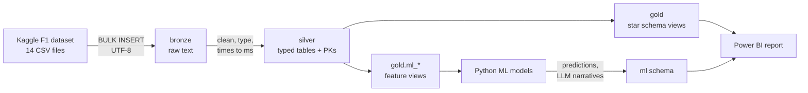
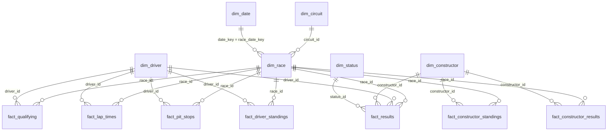

# F1 Data Warehouse — SQL Server

A Formula 1 data warehouse built in **Microsoft SQL Server (T-SQL)** with a **bronze → silver → gold** (medallion) design, run entirely from **SSMS**. It turns 14 raw CSV files covering every championship race since 1950 into a tested star schema for Power BI, plus leakage-safe feature views for machine learning.



## What is in it

| Layer | Objects | What happens |
| --- | --- | --- |
| **bronze** | 14 tables | CSVs loaded as text, exactly as delivered (`'\N'` and all) |
| **silver** | 14 tables | Cleaned, typed, snake_case, times in milliseconds, primary keys |
| **gold** | 6 dimensions, 7 facts, 2 aggregate / flat views | Star schema for reporting |
| **gold.ml_\*** | 2 feature views | One row per driver per race, only pre-race information |
| **ml** | 3 tables | Empty; the Python ML / LLM project writes predictions and narratives here |
| **meta** | `load_log` + `run_pipeline` | Every load logged: rows, duration, status, error |

## Gold star schema



Column-by-column descriptions: [docs/data_catalog.md](docs/data_catalog.md).

## Repository layout

```
F1 Data Warehouse/
├── README.md
├── datasets/
│   └── README.md                  where to download the CSVs (not committed)
├── docs/
│   ├── data_catalog.md            every gold column explained
│   └── naming_conventions.md
├── sql/
│   ├── 00_init_database.sql       F1_DB + schemas (drops an existing F1_DB!)
│   ├── 01_meta_load_log.sql       run log table
│   ├── 02_ddl_bronze.sql          14 raw tables
│   ├── 03_proc_load_bronze.sql    bronze.load_bronze  (BULK INSERT, UTF-8)
│   ├── 04_functions.sql           dbo.fn_clean, dbo.fn_time_to_ms
│   ├── 05_ddl_silver.sql          14 typed tables
│   ├── 06_proc_load_silver.sql    silver.load_silver + meta.run_pipeline
│   ├── 07_gold_dimensions.sql     dim_driver, dim_constructor, dim_circuit, dim_race, dim_status, dim_date
│   ├── 08_gold_facts.sql          fact_results, fact_qualifying, fact_lap_times, fact_pit_stops, standings, constructor results
│   ├── 09_gold_aggregates.sql     agg_driver_season, vw_f1_master
│   ├── 10_gold_ml_features.sql    ml_driver_race_features, ml_pit_features
│   ├── 11_ddl_ml_schema.sql       ml.model_runs, ml.predictions, ml.narratives
│   └── 12_run_pipeline.sql        load everything
└── tests/
    ├── quality_checks_bronze.sql
    ├── quality_checks_silver.sql
    └── quality_checks_gold.sql
```

## Run it

**Requirements:** SQL Server **2017 or later** (Express is fine; `BULK INSERT ... FORMAT = 'CSV'` needs 2017+) and SSMS.

1. **Get the data.** Download the [Formula 1 Race Data](https://www.kaggle.com/datasets/jtrotman/formula-1-race-data) dataset from Kaggle and unzip the 14 CSV files into one folder, for example `C:\f1_data\raw\`. See [datasets/README.md](datasets/README.md).
2. **Create the objects.** In SSMS, open and execute `sql/00` through `sql/11`, in order. Each file is re-runnable.
3. **Load.** Open `sql/12_run_pipeline.sql`, set `@source_path` to your CSV folder, execute. Expect a few minutes; `lap_times` (~620k rows) is the largest table. The result grid shows rows loaded per table.
4. **Check.** Run the three files in `tests/`. Every row should read `PASS`. The gold check may show one `WARN` if the downloaded snapshot is older than today's calendar (past races without results yet).

Reload after a fresh download with one call:

```sql
EXEC meta.run_pipeline @source_path = N'C:\f1_data\raw\';
```

### Troubleshooting

| Error | Cause | Fix |
| --- | --- | --- |
| `Cannot bulk load because the file ... could not be opened. Operating system error code 5 (Access is denied.)` | The SQL Server **service account** cannot read the folder. SSMS runs the load on the server, not as you. | Put the CSVs in a plain folder such as `C:\f1_data\raw\` and give read access to `NT Service\MSSQLSERVER` (or `NT Service\MSSQL$SQLEXPRESS` for Express) in the folder's Security tab. |
| `... error code 3 (The system cannot find the path specified.)` | Wrong `@source_path`, or the path is on your PC while the server is remote. | Use a path as seen from the SQL Server machine. |
| `Incorrect syntax near 'FORMAT'` | SQL Server 2016 or older. | Upgrade to 2017+ (Express 2019/2022 is free). |
| Names like `Räikkönen` | CSV re-saved in another encoding. | Use the original Kaggle files (UTF-8). |
| A load step fails | Details are in the log. | `SELECT TOP (20) * FROM meta.load_log ORDER BY log_id DESC;` |

## Design decisions

- **Bronze is all text.** The source marks missing values with `\N`, so typed bronze columns would reject rows. Bronze keeps the file as delivered; silver does every conversion, and a failed conversion fails the load.
- **UTF-8 loaded as UTF-8.** `NVARCHAR` + `CODEPAGE = '65001'` keeps Räikkönen, Pérez and São Paulo intact.
- **Times in milliseconds.** `'1:26.572'` is minutes:seconds, which `TIME` cannot parse. `dbo.fn_time_to_ms` converts it, and a silver check proves it reproduces the source's own millisecond column on every lap.
- **Natural keys in gold.** `race_id`, `driver_id`, ... are stable across reloads; `ROW_NUMBER()` surrogate keys would renumber on every rebuild.
- **Gold as views.** No second copy of the data and no load step; gold is current as soon as silver is. Power BI imports it.
- **Result grain is never deduplicated.** 85 results from the 1950s–70s are two cars shared by one driver in the same race; deduplicating them deletes real points.
- **Classified means classified.** From 2025 the source also numbers retirements; silver keeps `position` only for classified finishers, so win, podium and DNF flags stay correct.
- **Points finish = `points > 0`,** not `position <= 10` (only the top 6 or 8 scored before 2010). **Pole** = qualifying P1, not grid P1 (grid penalties).
- **Standings are snapshots,** never summed. `is_final_round` and `is_season_complete` pick the right row; an in-progress season has no champion.
- **ML features cannot see the race they predict.** Every rolling window ends at the previous race, and `tests/quality_checks_gold.sql` recomputes one feature from scratch to prove it.

## Data notes

- Seasons 1950 to the current season; the current season's remaining races are present with `is_completed = 0`.
- Qualifying from 1994, pit stops from 1994, lap times from 1996, sprints from 2021.
- Constructor points differ from official tables in two places by design of the source: 2018 Force India (entry replaced mid-season) and 2020 Racing Point (15-point penalty). The gold check allows exactly these.

## Related projects

- **Power BI report** on this warehouse: `Power_BI_Projects` repository (coming).
- **Python ML + local LLM narratives** reading `gold.ml_*` and writing to `ml.*`: separate repository (coming).

## Credits

- Warehouse structure inspired by [Data with Baraa's SQL Data Warehouse project](https://www.youtube.com/watch?v=9GVqKuTVANE).
- Data: [Formula 1 Race Data](https://www.kaggle.com/datasets/jtrotman/formula-1-race-data) on Kaggle, in the Ergast database format. Check the dataset page for its licence before reusing the data.
